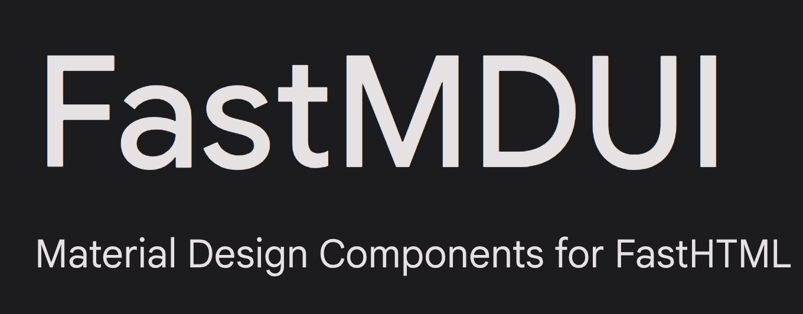

# FastMDUI

Material Design UI components for FastHTML projects with full Material Icons support.

<!-- Main Package Info -->
[](https://testpypi.org/project/fastmdui/)
[](https://testpypi.org/project/fastmdui/)
[](https://opensource.org/licenses/MIT)

<!-- Downloads -->
[](https://pepy.tech/project/fastmdui)
[](https://pepy.tech/project/fastmdui)

<!-- GitHub Stats -->
[](https://github.com/yourusername/fastmdui/stargazers)
[](https://github.com/yourusername/fastmdui/network/members)


<!-- Dependencies -->
[](https://fastht.ml/)
[](https://www.mdui.org/)

## Installation

```bash
pip install fastmdui
```

## Quick Start

```python
from fasthtml.common import FastHTML, serve
from fastmdui import MDUI, Button, Card, TextField, Icon, TopAppBar, TopAppBarTitle, ThemeToggle, Div

# Initialize with Material Icons and Open Sans font
app = FastHTML(hdrs=MDUI.headers())

@app.get("/")
def home():
    return (
        TopAppBar(
            TopAppBarTitle("My App"),
            Button(icon="menu", variant="text", slot="start"),
            Div(slot="end")(
                Button(icon="search", variant="text"),
                ThemeToggle()
            )
        ),
        Card(
            title="Welcome to fastMDUI",
            subtitle="Material Design for FastHTML",
            content=[
                TextField(label="Enter your name", type="text"),
                Button("Submit", variant="filled", icon="send"),
                Icon("favorite", variant="outlined")
            ]
        )
    )

serve()
```

## Material Icons Support

FastMDUI includes built-in support for Google Material Icons with multiple variants:

### Icon Variants

```python
# Choose your preferred icon style when initializing
app = FastHTML(hdrs=MDUI.headers(icons="outlined"))  # Outlined
app = FastHTML(hdrs=MDUI.headers(icons="rounded"))   # Rounded corners
app = FastHTML(hdrs=MDUI.headers(icons="sharp"))     # Sharp corners
app = FastHTML(hdrs=MDUI.headers(icons="filled"))    # Filled style
app = FastHTML(hdrs=MDUI.headers())       # default, all icons included (recommended)
```

**Note**: Using `icons="all"` ensures all icon variants work correctly across all components. This is recommended for full compatibility and selected by default.

### Using Icons

```python
from fastmdui import Icon, Button

# Standalone icon with variant
Icon("home", variant="outlined")
Icon("search", variant="rounded")
Icon("settings", variant="sharp")
Icon("favorite", variant="filled")

# Buttons with icons (simple attribute method) - MDUI handles rendering
Button("Search", icon="search")  # Icon at start
Button("Next", end_icon="arrow_forward")  # Icon at end
Button("Navigate", icon="arrow_back", end_icon="arrow_forward")  # Both

# Buttons with custom icon slots (advanced)
Button("Download",
       icon_slot=Icon("downloading", variant="outlined"),
       end_icon_slot=Icon("attach_file", variant="filled"))

# Icons in other components
Chip("Python", icon="code")
ListItem("Settings", icon="settings")
Fab(icon="add")
```

**Important**: When using the `icon` attribute on components like Button, Chip, etc., just pass the icon name as a string. MDUI will automatically render the icon using Material Icons.

### Troubleshooting Icons

If you see icon names as text instead of icons:

1. **Use `icons="all"`** when initializing to ensure all variants load:
   ```python
   app = FastHTML(hdrs=MDUI.headers(icons="all"))
   ```

2. **Check browser console** for font loading errors

3. **Verify icon names** at [Google Material Icons](https://fonts.google.com/icons) - use the exact names shown there (e.g., `arrow_forward`, not `arrow-forward`)

4. **Test icon loading** by running the icon test example:
   ```bash
   python examples/icon_test.py
   ```

5. **Ensure you're not blocking Google Fonts** - Material Icons load from Google's CDN

### Using Icons

```python
from fastmdui import Icon, Button

# Standalone icon with variant
Icon("home", variant="outlined")
Icon("search", variant="rounded")
Icon("settings", variant="sharp")
Icon("favorite", variant="filled")

# Buttons with icons (simple attribute method)
Button("Search", icon="search")  # Icon at start
Button("Next", end_icon="arrow_forward")  # Icon at end
Button("Navigate", icon="arrow_back", end_icon="arrow_forward")  # Both

# Buttons with custom icon slots (advanced)
Button("Download",
       icon_slot=Icon("downloading", variant="outlined"),
       end_icon_slot=Icon("attach_file", variant="filled"))

# Icons in other components
Chip("Python", icon="code")
ListItem("Settings", icon="settings")
Fab(icon="add")
```

### Button Icon Options

Buttons support icons in multiple ways:

1. **Simple icon attribute** (recommended for most cases):
```python
Button("Search", icon="search")
Button("Next", end_icon="arrow_forward")
Button("Navigate", icon="arrow_back", end_icon="arrow_forward")
```

2. **Custom icon slots** (for advanced styling):
```python
Button("Download",
       icon_slot=Icon("cloud_download", variant="outlined"),
       end_icon_slot=Icon("check", variant="filled", style="color: green;"))
```

### Available Icon Names

Browse the full icon library at [Google Material Icons](https://fonts.google.com/icons):
- `home`, `search`, `settings`, `favorite`, `menu`
- `add`, `delete`, `edit`, `check`, `close`
- `arrow_back`, `arrow_forward`, `expand_more`, `expand_less`
- `person`, `email`, `phone`, `location_on`
- And 2000+ more icons!

## Components

- **Button**: Material Design buttons with variants and icons
- **Card**: Cards for displaying content
- **TextField**: Text input fields
- **Select**: Dropdown selection
- **Checkbox, Radio, Switch**: Form controls
- **Dialog**: Modal dialogs
- **Snackbar**: Notification messages
- **Navigation**: NavigationBar, NavigationDrawer, TopAppBar (with child support)
- **Chip**: Compact elements for tags/filters
- **List**: Lists with items
- **Icon**: Material icons with variants (outlined, rounded, sharp, filled)
- **Avatar**: User avatars
- **Badge**: Notification badges
- **Fab**: Floating action buttons
- **Progress**: Progress indicators
- **Slider**: Range sliders
- **Tab**: Tabbed interfaces
- **Tooltip**: Hover tooltips
- **ThemeToggle**: Dark/Light theme toggle button
- **Div**: Convenience wrapper for div elements

## TopAppBar with Children

The TopAppBar component now accepts children, allowing you to add any UI components:

```python
from fastmdui import TopAppBar, TopAppBarTitle, Button, ThemeToggle, Div

# Simple title
TopAppBar(title="My App")

# With menu button at start
TopAppBar(
    TopAppBarTitle("My App"),
    Button(icon="menu", variant="text", slot="start")
)

# With actions at end
TopAppBar(
    TopAppBarTitle("My App"),
    Div(slot="end")(
        Button(icon="search", variant="text"),
        Button(icon="notifications", variant="text"),
        ThemeToggle()
    )
)

# Complete configuration
TopAppBar(
    TopAppBarTitle("My App"),
    Button(icon="menu", variant="text", slot="start"),
    Div(slot="end", style="display: flex; gap: 8px;")(
        Button(icon="search", variant="text"),
        Button(icon="more_vert", variant="text")
    )
)

# Custom content (no title prop)
TopAppBar(
    TopAppBarTitle("My App"),
    Button(icon="arrow_back", variant="text", slot="start"),
    TextField(placeholder="Search...", style="flex: 1; margin: 0 16px;"),
    Button(icon="close", variant="text", slot="end")
)
```

### TopAppBar Slots:
- **slot="start"**: Place elements at the start (left side) before the title
- **slot="end"**: Place elements at the end (right side) after the title
- **No slot**: Elements appear between start and end sections

## Theme Toggle

fastMDUI includes a built-in theme toggle component that allows users to switch between light and dark themes:

```python
from fastmdui import ThemeToggle, TopAppBar

# Add to your top bar
TopAppBar(title="My App")(
    Div(slot="end")(
        ThemeToggle()
    )
)

# Or use anywhere in your app
ThemeToggle()

# Customize icons
ThemeToggle(icon_light="wb_sunny", icon_dark="nights_stay")

# Or manually trigger with a custom button
Button("Toggle Theme", onclick="toggleTheme()")
```

### Theme Features:
- **Auto-detects system preference**: Automatically uses your system's theme setting
- **Persistent storage**: Remembers user's choice using localStorage
- **Smooth transitions**: Theme changes apply instantly to all components
- **Customizable icons**: Use any Material Icon for light/dark states

## Theming

```python
# Set theme, primary color, and icon style
app = FastHTML(hdrs=MDUI.headers(
    theme="dark",
    primary_light_color="100, 20, 30",
    primary_dark_color="100, 20, 30",
    icons="rounded"
))
```

### Theme Options
- `theme`: `"auto"` (default), `"light"`, or `"dark"`
- `primary_light_color`: Any rgb color (e.g., `"10, 0, 20"`)
- `primary_dark_color`: Any rgb color (e.g., `"100, 40, 35"`)
- `icons`: `"outlined"`, `"rounded"`, `"sharp"`, `"filled"`, or `"all"` (default)

## Examples

### Form with Icons

```python
from fastmdui import Card, TextField, Button, Icon

Card(
    title="Login",
    content=[
        Icon("person", variant="outlined"),
        TextField(label="Username", type="text"),
        Icon("lock", variant="outlined"),
        TextField(label="Password", type="password"),
        Button("Sign In", variant="filled", icon="login")
    ]
)
```

### Navigation with Icons

```python
from fastmdui import TopAppBar, TopAppBarTitle, NavigationBar, Fab

TopAppBar(
    TopAppBarTitle("FastMDUI App")
)

NavigationBar(
    # Add navigation items with icons
)

Fab(icon="add", variant="primary")
```

### Icon Gallery

```python
from fastmdui import List, ListItem, Divider

List(
    ListItem("Home", icon="home"),
    Divider(),
    ListItem("Search", icon="search"),
    Divider(),
    ListItem("Settings", icon="settings"),
    Divider(),
    ListItem("Favorites", icon="favorite"),
)
```

## License

MIT License